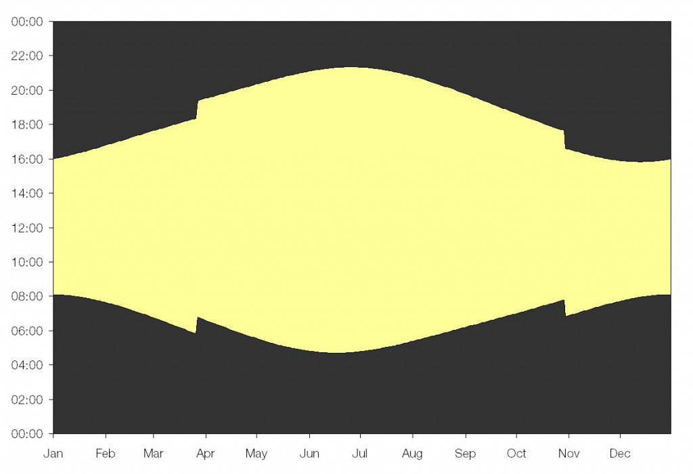

# Amanda's individual project (Energy saving automatic outside light)


## Table of contents
- [Program structure](#program-structure)
- [Hardware setup](#hardware-setup)
- [Demonstration video](#demonstration-video)
- [Related documentation](#related-documentation)
- [Learning outcomes](#learning-outcomes)
- [Project brief](#project-brief)
- [Project specification](#project-specification)
- [Supplementary information and help](#supplementary-information-and-help)


## Program structure
My program has been structured as follows:
1. ```"main.c/h"```

    The header file contains a useful line ```#define _TESTING_MODE``` which allows us to enter a "testing mode", where we pretend that a day lasts 24 seconds (instead of 24 hours). To switch back to the "normal mode", simply comment out this line ```// #define _TESTING_MODE```. We also configure our oscillators and windowed watchdog timer here. All other header files used in this project are included here too. 

    The source file contains our main function. We start by manually inputting the date and time when the device is first programmed. The sunrise time on the day that the device is first programmed can also be manually inputted too if known, or left to the default timing of 07:00:00 if unknown. We then proceed to initialise all our hardware modules. The program then runs indefinitely in an infinite while loop (or more realistically, until the hardware fails). During each iteration:
    - we check whether the sunrise/sunset flag has been toggled (by our high priority interrupt) and turn the street light off/on as required;
    - we check whether the time flag has been toggled (by our low priority interrupt) and increment our time for every second that passes by;
    - we switch off the street light from 1am-5am and disable the high priority interrupt (to prevent accidentally switching on the street light);
    - we display the current hour in binary on the LED array.

1. ```"dateandtime.c/h"```

    xx

1. ```"ADC.c/h"```

    xx

1. ```"comparator.c/h"```

    xx

1. ```"timers.c/h"```

    xx

1. ```"interrupts.c/h"```

    xx

1. ```"LED.c/h"```

    xx

1. ```"LEDarray.c/h"```

    xx

1. ```"LCD.c/h"```

    xx

My program uses the following standard libraries:
1. ```<xc.h>```

    The XC8 Compiler processor file.

1. ```<stdio.h>```

    The standard input and output library.


## Hardware setup
My hardware has been set up as in Lab 4.
- LED1 (on pin RH3) is used as the street light.
- LED2 (on pin RF7) is used as the minute indicator (it flashes every minute).
- The LED array is used as the hour indicator (it displays the hour in binary).
- The LCD screen is used as the date and time indicator during "testing mode" (it displays the date and time in decimal).


## Demonstration video
xx


## Related documentation
xx


## Learning outcomes
The principal learning objectives for this project are:
- Implement a working microprocessor based system to achieve a more complex real world task
- Develop your ability to independently plan, organise and structure your code 
- Improve your grasp of the C language and writing your own functions


## Project brief
Outside lights that respond to ambient light levels are commonplace (i.e. street lights, porch lights, garden lights etc). These types of lights switch on at dusk and then turn off at dawn. However, energy and money can be saved if these lights are switched off during the small hours of the morning (for example, between 1am and 5am), when there are very few people around. Many councils in the UK have implemented/trialled this idea for street lights (https://www.bbc.co.uk/news/uk-england-derbyshire-16811386). Your task is to use the knowledge of microcontrollers and hardware that you have gained in labs 1-3 from this module to develop a fully automated solution.


## Project specification
Design and program a device that meets the following requirements:
1. Monitors light level with the LDR and turns on an LED in low light conditions (i.e. night-time) and off in bright conditions (i.e. daytime)
1. Displays the current hour of day on the LED array in binary
1. Turns the light off between approx. 1am and 5am
1. Adjusts for daylight savings time
1. Maintain synchronicity with the sun indefinitely
1. Be fully automatic (requires zero maintenance after installation)
Please use this GitHub repo to manage your software development and submit your individual project code.


## Supplementary information and help
At first the task may seem quite straightforward but there are several points that often prove more tricky. The first is how to test code during development? You could test in real world conditions but you would be limited to one test cycle per day and this would severely slow down your development and debugging progress. To get around this you could implement a "testing mode" and pretend that a day lasts 24 seconds. This could be done using a #define directive to switch between "normal" and "testing" modes for your code.
Adjusting for daylight savings time is not too tricky. The clocks always change (in the UK) on the last Sunday in March (they go forward an hour) and the last Sunday in October (they go back an hour). One method of achieving this is to initialise what day it is when device is first switched on (using manual input) and then keep track of the days that pass and what the day of the week it is. Another method might be to automatically figure out what time of year it is (see below). Also don't forget about leap years! 
No clock is perfect, they can all run slightly fast/slow and can by influenced be external factors such as temperature. Ultimately this will result in drift over time and eventually the time will drift so far out of sync with real time that it is meaningless. For the purposes of our device the main requirement is that it remains in sync with the sun. You could use light from the sun to keep your clock in sync. Although the length of daylight varies considerably during the year, the midpoint between dusk and dawn only varies by a few minutes. This is termed solar midnight approx. 12am or solar noon approx. 12pm. One method of staying in sync with the sun is to use the LDR and record/calculate when these times occur and adjust your clock accordingly. The length of daylight also tells us information about what time of year it is and can be used to help us know when to adjust for daylight savings time.


http://wordpress.mrreid.org/2010/10/31/why-change-the-clocks/